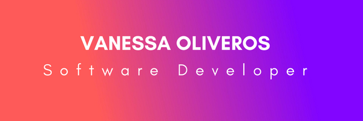
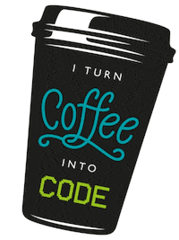

# Hello 👋👩‍💻


I am currently studying to become a professional software developer at Microverse 👩‍💻. I have a deep passion for creating functional websites or apps, collaborating with others, and inspiring and changing lives. I am a kind, committed, experienced and willing person to face any challenge.

## 🙋‍♀️🤩 A little more about me... 

```javascript
const vanessa = {
  pronouns: "she" | "her",
  languages: [JavaScript, HTML, CSS],
  technologies: [Bootstrap, node.js, Git, Webpack5, VSCode, GitHub],
}
```
<a href="https://github.com/vvoo21"></a>

## Find me around the web 🌎: 


